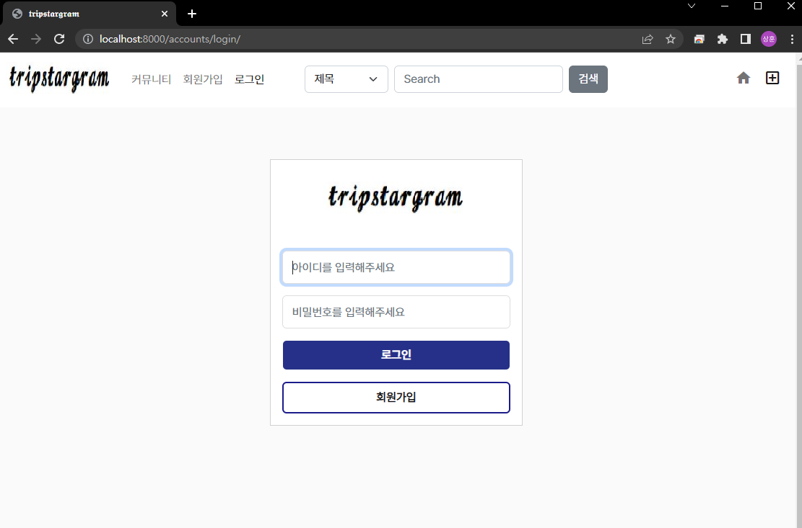
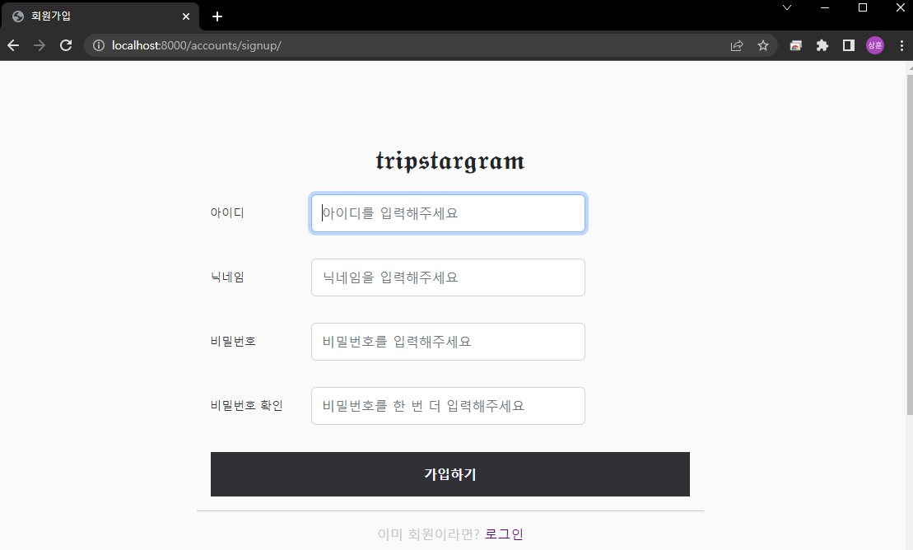

<h1>✈️ Tripstargram</h1>

개발기간 : 11/09 ~ 11/21 완료: ☑ 실패: ❎ 진행: ⬜

<h2>주제</h2>

* 여행 후기 및 정보 공유 커뮤니티 사이트
  * 웹 프레임워크 Django를 이용하여 구현하였고, 사용자들이 후기 등을 작성한 글을 볼 수 있는 Articles App 정보 공유를 위한 Comunity App 회원가입 및 로그인 기능이 포함된 Accounts App으로 이루어져 있습니다.

* 로그인

* 회원가입

* 글 작성

* 메인페이지

## 👨‍💻 프로젝트 진행 후 느낀점

| 프로젝트 시작할 때만 해도 약간의 여유가 있었으나.. 오산이었고, 약 2주라는 시간이 어떻게 지나가는지도 몰랐습니다.   Error 발생해서 고치면 또 다른 곳에서 Error 뜨고, 혼란스러운 와중에도 나름 필수 요소들은 완성 시킬 수 있었던 것 같습니다. 자바스크립트 부분을 좀 더 숙달해야 한다는 생각이 들었고, 다른 부가기능을 더 넣지 못해 아쉬웠습니다.         고생했지만 진행하는 동안 재미있었고 좋은 경험이었습니다! |
| ------------------------------------------------------------ |

<b>11/09 </b>

베이스 코드 작성

☑ 네비게이션 바 작성

- 네비게이션 바 내부 목록

  - 홈
  - 메시지
  - 추가
  - 템플릿
  - 좋아요 목록

☑메인 페이지 프론트 구성

<b>11/10</b>

☑모델 작성 및 DB 생성(글 내용, 이미지, 프로필이미지 , 유저 번호, 좋아요 수)

☑글 생성을 위한 모달창 및 글 작성 기능 구현

☑ 유저 로그인 모델 및 화면(html) 생성

개발이슈 : 글 작성 후 db에 저장되지 않았음(해결)

=> **Not Found: /content/upload** -- urls.py에 /content/uploads 라고 썼었던 것.. s 오타 하나가 있었다.. (오타 조심하자)

<b>11/11</b>

☑ 로그아웃

☑ 프로필 페이지, 프로필 사진 추가

☑ 우측 상단 프로필 이미지 누르면 드롭다운 형식으로 탭 나오게 구성

개발 이슈 : 프로필 이미지 업로드 중 GET http://localhost:8000/media/ 404 (Not Found) 오류 발생

content 모델의 내 content클래스의 image 저장경로를 설정을 따로 해주지 않아 발생한 오류.

11/14

☑ 댓글 작성 기능(비동기)

☑ 북마크,좋아요 모델 생성

11/15

☑ 좋아요 , 북마크 기능 구현 ( 좋아요 수정 완료)

☑ 사용자가 작성한 게시물, 좋아요 누른 게시물, 북마크 누른 게시물 각각 모아보기 기능 구현

11/16

☑  로그인,회원가입 디자인 변경

☑  팔로우 기능 구현

11/17

❎ 해당 유저가 팔로우가 없는 경우 메인 페이지에 팔로우 할 수 있는 유저 목록 팝업되게 해보기.

개발이슈 : User 테이블에 있는 사용자 닉네임과 Profile 테이블에 있는 프로필 이미지를 같이 띄우려고 했으나..테이블 간 JOIN을 이용해서 구현해보려 했으나..

11/18

☑ 회원 디테일 페이지 디자인 변경
